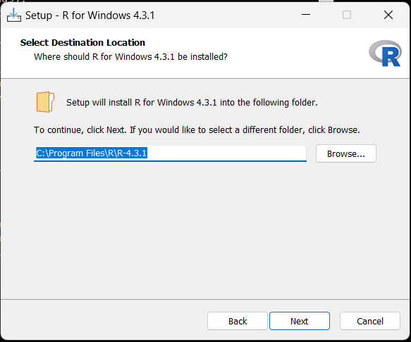

## Jupyter Lab

1. Den Python Installer herunterladen: <br>
[download Python](https://www.python.org/ftp/python/3.11.5/python-3.11.5-amd64.exe)<br>
In eurem Download Ordner sollte nun die Datei "python-3.11.5-amd64.exe" sein. Klickt mit der rechten Maustaste da drauf und führt sie als Administrator aus. Achtung! Hier wird es das erste mal knifflig. Die Settings für die Installation unbedingt wie unten auf den Bildern anwählen<br>


<br>
So weit so gut!
<br>
2. Den R-Language Installer herunterladen: <br>
[download R](https://cran.r-project.org/bin/windows/base/R-4.3.1-win.exe)<br>
In eurem Download Ordner müsste nun die Datei "R-4.3.1-win.exe" sein. Klickt mit der rechten Maustaste da drauf und führt sie als Administrator aus. Die Settings könnt ihr lassen, wie sie sind. Vergleicht aber den Pfad eurer Installation mit dem unten auf dem Bild. Falls der nicht gleich ist, müsst ihr den Befehl unter Punkt 3 entsprechend anpassen.<br>


3. Wenn die Installation abgeschlossen ist müsst ihr CMD als Administrator öffnen. Dazu gebt ihr im Suchfenster cmd ein und klickt mit der rechten Maustaste auf das CMD Symbol und wählt "Als Administrator ausführen". Falls du dich fragst was cmd ist - es ist ein Programm, das es ermöglicht den Computer durch die Eingabe von Text zu steuern.<br>
Im CMD gebt ihr nun den Befehl unten ein und drückt Enter (stimmt der Pfad mit der R Installation überein? Copy paste hilft...):

    ```bash
    setx PATH "%PATH%;C:\Program Files\R\R-4.3.1\bin"
    ```
4. Dass diese Änderung wirksam ist musst du CMD schließen und neu öffnen - wieder als Administrator. Führt folgende Befehle der Reihe nach aus - es kann jeweils eine Weile dauern...

    ```bash
    pip install jupyterlab
    ```

    ```bash
    R -e "install.packages('IRkernel', repos='http://cran.us.r-project.org')"
    ```

    ```bash
    R -e "IRkernel::installspec(user = FALSE)"
    ```

    ```bash
    R -e "install.packages('tidyverse', repos='http://cran.us.r-project.org')"
    ```

    ```bash
    R -e "install.packages('devtools', repos='http://cran.us.r-project.org')"
    ```

    ```bash
    R -e "install.packages('ggplot2', repos='http://cran.us.r-project.org')"
    ```

    ```bash
    R -e "install.packages('pak', repos = sprintf('https://r-lib.github.io/p/pak/stable/%s/%s/%s', .Platform$pkgType, R.Version()$os, R.Version()$arch), clean = TRUE)"
    ```

5. Falls ihr bis hier gekommen seid ohne Fehlermeldungen solltet ihr eigentlich fertig sein und könnt das CMD schliessen.<br> Wenn ihr nun Jupyter starten wollt, müsst ihr jeweils im CMD (NICHT als Administrator ausführen) folgenden Befehl eingeben:

    ```bash
    jupyter lab
    ```

## Hier könnt ihr euch das Leben einfacher machen - <br> Startdatei einrichten

Der Vorteil dabei ist, dass du nicht jedes mal CMD öffnen musst um Jupyter zu starten und du direkt in deinem Jupyter Ordner bist. <br>
1. Lege dir einen Ordner mit dem Namen "Jupyter" in deinem Dokumente Ordner an.
2. Öffne den Editor Notepad (gib Notepad im Suchfenster ein)
3. Ihr seid gleich in einem leeren Dokument. Auf die erste Zeile schreibt ihr:
    ```
    jupyter lab
    ```
4. Speichere die Datei als "startJupyter.bat" in deinem neuen Jupyter Ordner ab.<br> **!!! Wichtig ist, dass du bei "Dateityp" "Alle Dateien" auswählst und nicht "Textdatei"**.<br>
5. Klicke auf die Datei um Jupyter zu starten. Wenn du möchtest kannst du dir auch ein Icon auf deinen Desktop legen. Dazu klickst du mit der rechten Maustaste auf die Datei und wählst "Verknüpfung erstellen". Diese kannst du dann auf deinen Desktop ziehen.
