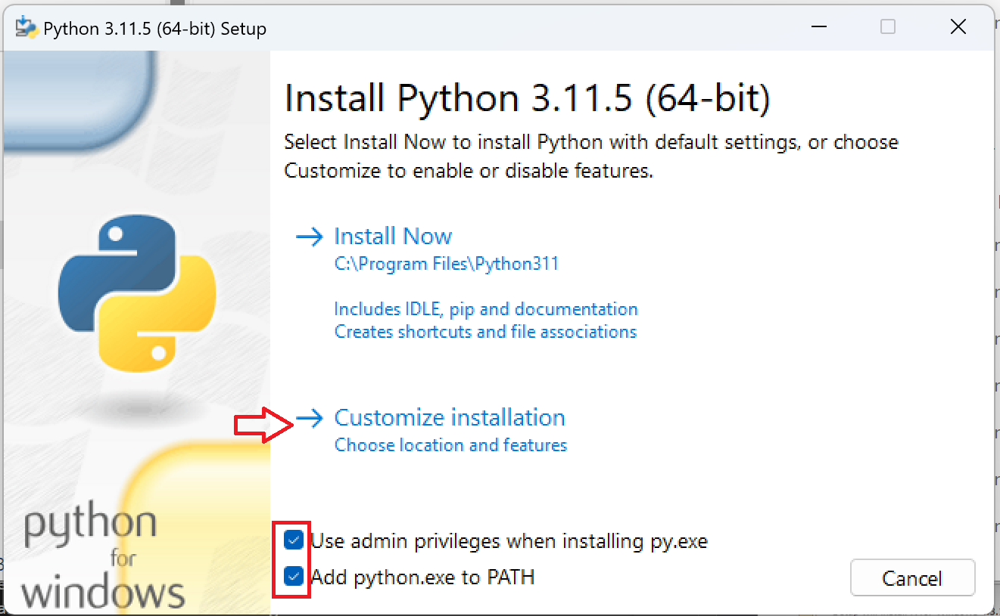

## Jupyter Lab

Diesen [Python](https://www.python.org/ftp/python/3.11.5/python-3.11.5-amd64.exe) installer herunterladen und installieren. Dabei müssen folgende Einstellungen gewählt sein:<br>


<br>
So weit so gut!
<br><br>

Danach diesen [R-Language](https://cran.r-project.org/bin/windows/base/R-4.3.1-win.exe) Installer herunterladen und installieren. Lasst überall die standard Einstellungen. Falls der Pfad bei euch nicht der gleiche ist wie der im Bild unten müsst ihr den kopieren um den nächsten Befehl anpassen zu können:<br>


Wenn die Installation abgeschlossen ist müsst ihr CMD als Administrator öffnen. Dazu gebt ihr im Suchfenster cmd ein und klickt mit der rechten Maustaste auf das CMD Symbol und wählt "Als Administrator ausführen". Falls du dich fragst was cmd ist - es ist ein Programm, das es ermöglicht den Computer durch die Eingabe von Text zu steuern.<br>
Im CMD gebt ihr nun den Befehl unten ein und drückt Enter (stimmt der Pfad mit der R Installation überein? Copy paste hilft...):

```bash
setx PATH "%PATH%;C:\Program Files\R\R-4.3.1"
```
Nun müsst ihr das CMD schließen und neu öffnen - wieder als Administrator. Führt folgende Befehle der Reihe nach aus - es kann jeweils eine Weile dauern...

```bash
pip install jupyterlab
```

```bash
R -e "install.packages('IRkernel', repos='http://cran.us.r-project.org')"
```

```bash
R -e "IRkernel::installspec(user = FALSE)"
```

```bash
R -e "install.packages('ggplot2', repos='http://cran.us.r-project.org')"
```

```bash
R -e "install.packages('devtools', repos='http://cran.us.r-project.org')"
```

```bash
R -e "install.packages('ggplot2', repos='http://cran.us.r-project.org')"
```

```bash
R -e "install.packages('pak', repos = sprintf('https://r-lib.github.io/p/pak/stable/%s/%s/%s', .Platform$pkgType, R.Version()$os, R.Version()$arch), clean = TRUE)"
```

Falls ihr bis hier gekommen seid ohne Fehlermeldungen solltet ihr eigentlich fertig sein und könnt das CMD schliessen.<br> Wenn ihr nun Jupyter starten wollt, müsst ihr jeweils im CMD (NICHT als Administrator ausführen) folgenden Befehl eingeben:

```bash
jupyter lab
```